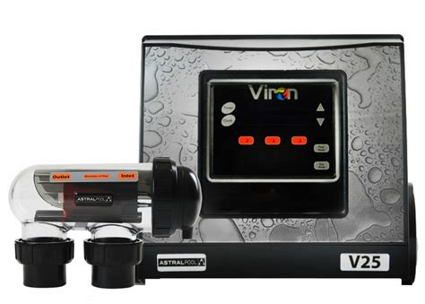

# MQTT Gateway for Astral Pool chlorinators

## Intention

The intention of this application is to integrate an AstralPool Viron chlorinator and CTX 280 pool pump into [Home Assistant](https://www.home-assistant.io/) end [evcc](https://evcc.io/en/) so the pool pump can be automatically started and stopped based on surplus solar energy.



The [Astral Pool Viron eQuilibrium Chlorinator](https://github.com/pbutterworth/astralpool_chlorinator) integration for Home Assistant is already available and works well. However, it requires the chlorinator to be within Bluetooth range of the Home Assistant hardware, which isn’t always practical. For example, in my setup, the pool pump and chlorinator are located outside, well beyond the Bluetooth range of the Home Assistant controller inside the house. Fortunately, the area still has Wi-Fi coverage, making a Wi-Fi-based connection a viable alternative.


To make the data available to Home Assistant over Wi-Fi, I created a simple gateway that publishes the chlorinator data to Home Assistant's MQTT broker.
The gateway is written in C++ and the BLE interface is based on a port of the [pychlorinator](https://github.com/pbutterworth/pychlorinator) Python library.


## Requirements

### Chlorinators

Supported chlorinators include the older *Viron V* with Bluetooth and newer *Viron eQuilibrium* series from AstralPool. Support for the *Halo* series would be possible but needs minor code changes. Basically if you can control the chlorinator controller with the *ChlorinatorGO* smartphone app, this gateway should work.

Tested it with an *Astra Pool Viron V25* chlorinator.


### Gateway Hardware

A ESP32 device with Wifi and BLE Bluetooth support. Tested it with a *ESP32-PICO-devkitm-2*.


## Installation

The package is based on PlatformIO. To build run:


    pio run --target upload && pio device monitor


## Configuration

Copy `.env.sample` to `.env` and edit the configuration settings to suit your local setup. The access code is the same code used to connect with the *ChlorinatorGO* smartphone app and can be found in the chlorinators' maintenance menu.


## Operation

After starting the Python app, it will connect to the MQTT broker and also establish the BLE connection with the chlorinator. Once both are established, the chlorinator state is updated cyclically every 10s. The app automatically re-connects to broker and chlorinator.

It publishes the topic `chlorinator/state` with a JSON object reflecting the chlorinator state

The most important state attribute is the `mode`:

| Name       | Value |
|------------|-------|
| Off        | 0     |
| ManualOn   | 1     |
| Auto       | 2     |


```json
{
  "mode": 1,
  "pump_speed": 2,
  "active_timer": 0,
  "info_message": "NoMessage",
  "ph_measurement": 0,
  "chlorine_control_status": 0,
  "chemistry_values_current": false,
  "chemistry_values_valid": false,
  "time_hours": 18,
  "time_minutes": 33,
  "time_seconds": 48,
  "spa_selection": false,
  "pump_is_priming": false,
  "pump_is_operating": true,
  "cell_is_operating": true,
  "sanitising_until_next_timer_tomorrow": false
}
```

In case of an BLE connection error the json object will just be an error object:

```json
{"error": "Some error message"}
```


It also subscribes to the topic `chlorinator/action` were a valid action can be written to.

The action can be one of these values:

| Action                             | Value |
|------------------------------------|-------|
| NoAction                           | 0     |
| Off                                | 1     |
| Auto                               | 2     |
| Manual                             | 3     |
| Low                                | 4     |
| Medium                             | 5     |
| High                               | 6     |
| Pool                               | 7     |
| Spa                                | 8     |
| DismissInfoMessage                 | 9     |
| DisableAcidDosingIndefinitely      | 10    |
| DisableAcidDosingForPeriod         | 11    |
| ResetStatistics                    | 12    |
| TriggerCellReversal                | 13    |

Note: Not every chlorinator model supports all of these actions.


## Credit

This work would not have been possible without P Butterworth's prior work of the [pychlorinator](https://github.com/pbutterworth/pychlorinator) library and the [Astral Pool Viron eQuilibrium Chlorinator](https://github.com/pbutterworth/astralpool_chlorinator) plugin.
